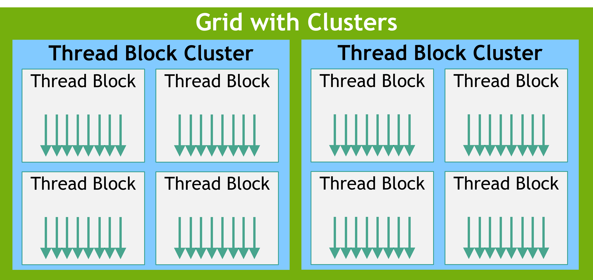

# プログラミングモデル

この章では、C++ のコードを示しながら、CUDA のプログラミングモデルの背景にある主要な概念を紹介します。
より詳細な C++ 拡張は次章で説明します。
本章で扱うベクトル加算のサンプルコードは、[vectorAdd CUDA sample](https://docs.nvidia.com/cuda/cuda-samples/index.html#vector-addition) を参照してください。

## 2.1. カーネル

通常、C++ の関数は呼び出されると1回だけ処理を実行します。
一方、CUDA では、呼び出された関数が N 個の CUDA スレッドで並列に N 回実行されるように C++ を拡張しています。
カーネルは ```__global__``` 宣言指定子 (declaration specifier) を用いて定義します。
また、CUDA スレッドの数は ```<<<...>>>``` 実行設定文法 (execution configuration syntax) で指定します。
カーネルを実行する各カーネルにはユニークなスレッド ID が割り当てられ、組み込み変数としてアクセス可能です。
次のサンプルコードは、組み込み変数 ```threadIdx``` を使って2つのベクトル ```A```、```B``` の和を計算しています。

```c++
// Kernel definition
__global__ void VecAdd(float* A, float* B, float* C)
{
    int i = threadIdx.x;
    C[i] = A[i] + B[i];
}

int main()
{
    ...
    // Kernel invocation with N threads
    VecAdd<<<1, N>>>(A, B, C);
    ...
}
```

## 2.2. スレッドの階層構造

```threadIdx``` は、3つの要素からなるベクトルで、1次元から3次元のスレッドインデックスを用いて、スレッドブロックと呼ばれる1次元から3次元のスレッドのブロックを作成できます。
これによって、ベクトルや行列、ボリュームなどの要素に対して演算を実行することができます。
スレッド ID は、スレッドのインデックスから次のように計算できます。

- 1次元の場合：サイズとインデックスは同じ 
- 2次元の場合：サイズ $(D_x, D_y)$、インデックス $(x, y) = x + yD_x$
- 3次元の場合：サイズ $(D_x, D_y, D_z)$、インデックス $(x, y, z) = x + yD_x + zD_xD_y$

次のコードは $N \times N$ の行列 $A$、$B$ の和を計算しています。

```c++
__global__ void MatAdd(float A[N][N], float B[N][N],
                       float C[N][N])
{
    int i = threadIdx.x;
    int j = threadIdx.y;
    C[i][j] = A[i][j] + B[i][j];
}

int main()
{
    ...
    // Kernel invocation with one block of N * N * 1 threads
    int numBlocks = 1;
    dim3 threadsPerBlock(N, N);
    MatAdd<<<numBlocks, threadsPerBlock>>>(A, B, C);
    ...
}
```

ただし、ブロック内のすべてのスレッドは、同じストリーミングプロセッサコアに存在し、そのコアの限られたメモリ資源を共有する必要があるため、ブロックごとのスレッド数には制限があります。
現在の GPU では、その上限は1024に設定されています。

しかし、カーネルは同じ形状のスレッドブロックを複数実行することができます。
そのため、スレッド数の合計は、ブロックごとのスレッド数とブロック数の掛け算になります。
スレッドブロックは1次元から3次元までのグリッド (grid) にまとめられます。
グリッドに含まれるスレッドブロックの数は、処理するデータサイズによって規定されます。
その数は、システム内のプロセッサ数を超えることもあり得ます。

<div align="center"></div>

ブロックごとのスレッド数とグリッドごとのブロック数は、 ```<<<...>>>``` で ```int``` 型か ```dim3``` 型の値を用いて指定できます。
2次元のブロック、あるいはグリッドは上記の例で指定できます。
あるグリッド内のブロックも、組み込み変数 ```blockIdx``` を通して、カーネル内から1次元から3次元のユニークなインデックスで指定できます。
また、スレッドブロックの次元は、```blocDim``` 変数から取得できます。
以下の例は、 ```MatAdd``` 関数を複数のブロックに拡張したものです。

```c++
__global__ void MatAdd(float A[N][N], float B[N][N],
float C[N][N])
{
    int i = blockIdx.x * blockDim.x + threadIdx.x;
    int j = blockIdx.y * blockDim.y + threadIdx.y;
    if (i < N && j < N)
        C[i][j] = A[i][j] + B[i][j];
}

int main()
{
    ...
    // Kernel invocation
    dim3 threadsPerBlock(16, 16);
    dim3 numBlocks(N / threadsPerBlock.x, N / threadsPerBlock.y);
    MatAdd<<<numBlocks, threadsPerBlock>>>(A, B, C);
    ...
}
```

スレッドブロックのサイズは任意に指定できますが、$16 \times 16 = 256$ スレッドとするのが一般的です。
グリッドは、1スレッドに1つの行列要素が割り当てられるように作成します。
簡単のため、この例では各次元のグリッドあたりのスレッド数が、その次元のブロックあたりのスレッド数で均等に割り切れると仮定していますが、そうである必要はありません。
スレッドブロックは、並列でも直列でも、どんな順番だろうと各々が独立して実行可能である必要があります。
独立に実行可能であるという制約があるおかげで、どんなコア数でも任意の順序でスレッドブロックをスケジューリングできます。
これによって、コア数でスケールするコードを書けるようになります。  
ブロック内のスレッドは、共有メモリを通してデータを共有し、メモリアクセスを調整するために実行を同期させることで、協調動作させることができます。
より正確に言うと、カーネル内で同期を取るタイミングを ```__syncthreads()``` 関数を呼び出すことで指定できます。
```__syncthreads()``` は、ブロック内のすべてのスレッドの実行を進める許可が出るまで待機させるバリアとして機能します。
共有メモリについては口述します。
また、```__syncthreads()``` に加えて、Cooperative Groups API では、リッチなスレッド同期のためのプリミティブが提供されています。
効果的に協調動作させるためには、共有メモリは L1 キャッシュのように低地縁で各プロセッサコアの近くにあり、```__syncthreads()``` は軽量であることが期待されます。

### 2.2.1 スレッドブロッククラスタ (thread block cluster)

NVIDIA Compute Capability (CC) 9.0 では、スレッドブロックで構成されるスレッドブロッククラスタと呼ばれる新たな階層が導入されました。
ストリーミングマルチプロセッサ上でスレッドブロック中のスレッドが協調的にスケジューリングのと同じ方法で、GPU の GPC (GPU Processing Cluster) 上でクラスタ内のスレッドブロックが協調的にスケジューリングされることを保証しています。
スレッドブロックと同様、クラスタも1次元から3次元まで設定できます。
クラスタのスレッドブロック数はユーザ定義可能で、ポータブルなサイズとして最大8個のスレッドブロックがサポートされています。
8個のマルチプロセッサをサポートできないような小型の GPU や MIG 構成の場合、クラスタの最大数が縮小されることには注意が必要です。
このような小さな構成や、8個を超えるスレッドブロッククラスタサイズをサポートする大きい構成の特定はアーキテクチャ固有であり、```cudaOccupancyMaxPotentialClusterSize``` API を使用してクエリすることができます。

<div align="center"></div>

スレッドブロッククラスタは、コンパイラ時に ```__cluster_dims__(X, Y, Z)``` を用いてカーネル属性を指定してもよいですし、CUDA のカーネル起動 API ```cudaLaunchKernelEx``` を用いて有効化することが可能です。
以下の例では、コンパイラ時のカーネル属性を用いてクラスタを起動しています。
カーネル属性を用いた場合、クラスタサイズはコンパイル時に確定され、```<<< , >>>``` を用いてカーネルを起動できます。
この場合、カーネルの起動時にはクラスタサイズを修正することはできません。

```c++
// Kernel definition
// Compile time cluster size 2 in X-dimension and 1 in Y and Z dimension
__global__ void __cluster_dims__(2, 1, 1) cluster_kernel(float *input, float* output)
{
    ...
}

int main()
{
    float *input, *output;
    // Kernel invocation with compile time cluster size
    dim3 threadsPerBlock(16, 16);
    dim3 numBlocks(N / threadsPerBlock.x, N / threadsPerBlock.y);

    // The grid dimension is not affected by cluster launch, and is still enumerated
    // using number of blocks.
    // The grid dimension must be a multiple of cluster size.
    cluster_kernel<<<numBlocks, threadsPerBlock>>>(input, output);
}
```

スレッドブロッククラスタのサイズは実行時に設定することも可能で、CUDA の API ```cudaLaunchKernelEx``` を用いてカーネルを起動します。
以下に示すサンプルコードは、拡張可能な API を用いてクラスタカーネルを立ち上げています。

```c++
// Kernel definition
// No compile time attribute attached to the kernel
__global__ void cluster_kernel(float *input, float* output)
{
    ...
}

int main()
{
    float *input, *output;
    dim3 threadsPerBlock(16, 16);
    dim3 numBlocks(N / threadsPerBlock.x, N / threadsPerBlock.y);
    cluster_kernel<<<numBlocks, threadsPerBlock>>>();
    // Kernel invocation with runtime cluster size
    {
        cudaLaunchConfig_t config = {0};
        // The grid dimension is not affected by cluster launch, and is still enumerated
        // using number of blocks.
        // The grid dimension should be a multiple of cluster size.
        config.gridDim = numBlocks;
        config.blockDim = threadsPerBlock;

        cudaLaunchAttribute attribute[1];
        attribute[0].id = cudaLaunchAttributeClusterDimension;
        attribute[0].val.clusterDim.x = 2; // Cluster size in X-dimension
        attribute[0].val.clusterDim.y = 1;
        attribute[0].val.clusterDim.z = 1;
        config.attrs = attribute;
        config.numAttrs = 1;

        cudaLaunchKernelEx(&config, cluster_kernel, input, output);
    }
}
```

CC 9.0 以降の GPU において、クラスタ内のすべてのスレッドブロックは、単一の GPC 上で協調的にスケジューリングされることが保証されています。
また、クラスタ内のスレッドブロックは ```cluster.sync()``` API を用いてハードウェア支援機能でを用いて同期を取ることができます。
さらに、それぞれ ```num_threads()``` や ```num_blocks()``` を用いて、クラスタグループのスレッド数やブロック数を取得することができます。
スレッドやブロックのランクは、```dim_threads()``` や ```dim_blocks()``` でそれぞれ取得できます。  
クラスタに属するスレッドブロックは、分散共有メモリ (distributed shared memory) にアクセスできます。
クラスタ内のスレッドブロックは、分散共有メモリの任意のアドレスに読み書きやアトミックの実行が可能です。

## 2.3. メモリ階層